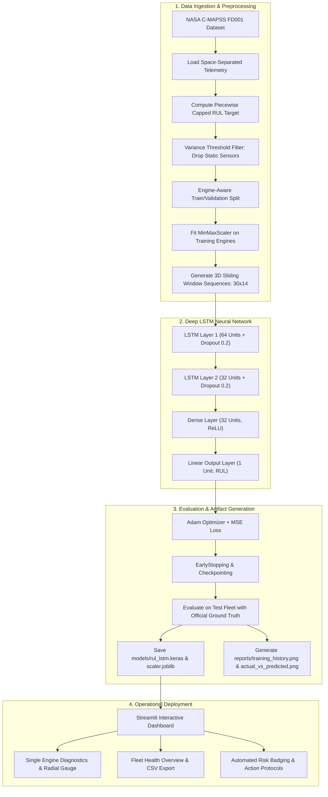

# ✈️ TurboLife AI
### Remaining Useful Life (RUL) Prediction for Turbofan Engines using Deep LSTM


---

## 📖 Project Overview

**TurboLife AI** is an intelligent predictive-maintenance system designed for commercial aviation and gas turbine operations. By analyzing temporal degradation trends across 21 thermodynamic and mechanical sensors from the **NASA C-MAPSS (Commercial Modular Aero-Propulsion System Simulation)** dataset, TurboLife AI utilizes a **Deep 2-Layer Long Short-Term Memory (LSTM)** neural network to estimate the exact number of remaining operational flight cycles before engine overhaul is necessary.

---

## 🛫 Real-World Aviation Maintenance Scenario

Modern commercial airliners operate high-bypass turbofan jet engines that undergo severe thermal, aerodynamic, and mechanical stress during each flight mission. 
In traditional aviation operations:
- **Reactive Maintenance (Run-to-Failure)** risks catastrophic in-flight engine shutdowns, emergency diversions, and massive unscheduled downtime costs exceeding \$1,000,000 per incident.
- **Fixed-Interval Scheduled Maintenance (Preventive)** pulls healthy engines out of service prematurely based on arbitrary calendar schedules, wasting millions of dollars in remaining component life.

**TurboLife AI introduces Condition-Based Predictive Maintenance**:
By evaluating the recent sensor telemetry history (e.g. temperatures at compressor and turbine outlets, fan and core rotational speeds, bypass ratios, and bleed enthalpies) over the last 30 flight cycles, TurboLife AI calculates the precise **Remaining Useful Life (RUL)**.

> **Example**:
> If Engine Unit #20 is currently at Flight Cycle 150 and the LSTM predicts $\text{RUL} = 18$, the airline fleet management team knows the engine can safely complete approximately 18 more flights before reaching critical wear thresholds, allowing maintenance engineers to schedule servicing during an upcoming airport layover without flight cancellations.

---

## 🔑 Key Engineering Concepts

### 1. What is a "Cycle"?
A **Flight Cycle** represents one full operational mission:
$$\text{Engine Start} \longrightarrow \text{Taxi} \longrightarrow \text{Takeoff} \longrightarrow \text{Climb} \longrightarrow \text{Cruise} \longrightarrow \text{Descent} \longrightarrow \text{Landing} \longrightarrow \text{Shutdown}$$
Each cycle subjects turbine blades, compressor discs, and combustors to severe thermal expansion and rotational stresses.

### 2. What is Remaining Useful Life (RUL)?
**Remaining Useful Life (RUL)** is the number of operational cycles left before a component or engine degrades beyond safe operating tolerances:
$$\text{RUL}_t = t_{\text{failure}} - t_{\text{current}}$$

### 3. Why Piecewise Linear RUL Target Capping (125 Cycles)?
In early operational life ($>125$ cycles prior to failure), a healthy engine exhibits virtually zero observable degradation signatures; sensor readings remain flat within nominal manufacturing tolerances. 
- Attempting to predict linear degradation from cycle 1 forces neural networks to learn noisy, non-existent wear signals.
- TurboLife AI caps training target RUL at **125 cycles**:
$$\text{RUL}_{\text{target}} = \min(t_{\text{failure}} - t, 125)$$
This enables the LSTM to focus its gradient learning on the critical exponential wear and fatigue phases.

### 4. Why Use Deep LSTM Networks?
Standard machine learning models (such as Linear Regression or basic Decision Trees) treat each sensor measurement as an isolated snapshot in time. However, engine degradation is inherently **temporal and non-linear**:
- A single high temperature reading could simply be a hot day or transient climb power.
- A steady upward temperature drift across 30 consecutive flight cycles indicates high-pressure compressor (HPC) fouling or seal degradation.
- **LSTM (Long Short-Term Memory)** recurrent neural networks possess internal memory cells and gating mechanisms ($\text{forget}$, $\text{input}$, and $\text{output}$ gates) capable of tracking multi-sensor trend trajectories across long sequential windows.

---

## 📊 End-to-End System Architecture



---

## 🚦 Operational Risk Matrix & Protocols

| Risk Tier | RUL Threshold | Status Badge | Maintenance Protocol Recommendation |
| :--- | :--- | :--- | :--- |
| **🟢 Healthy** | $\text{RUL} > 80\text{ cycles}$ | `HEALTHY` | Continue normal scheduled operations. Maintain routine telemetry monitoring. |
| **🟡 Monitor** | $31 \le \text{RUL} \le 80\text{ cycles}$ | `MONITOR` | Schedule borescope inspection and servicing during upcoming planned maintenance window. |
| **🔴 High Risk** | $\text{RUL} \le 30\text{ cycles}$ | `HIGH RISK` | Urgent maintenance required. Ground engine for overhaul prior to further flight operations. |

---

## 📁 Project Directory Structure

```
turbolife-ai/
│
├── config.py                 # Central configurations, hyperparameters, paths, risk rules, sensor dictionary
├── preprocess.py             # CMAPSS loader, RUL target calculation, variance filtering, normalization, 3D sequencing
├── model.py                  # Keras Deep 2-Layer LSTM regression architecture
├── train.py                  # End-to-end training pipeline, checkpointing, evaluation, diagnostic plotting
├── predict.py                # Standalone batch inference module & risk classification
├── app.py                    # Streamlit interactive predictive maintenance dashboard
├── requirements.txt          # Verified dependency versions
├── README.md                 # Complete project documentation & viva defense script
├── .gitignore                # Git exclusions
│
├── data/
│   ├── README.md             # Dataset documentation, column schemas, sensor descriptions
│   ├── train_FD001.txt       # 100 Run-to-failure engine trajectories
│   ├── test_FD001.txt        # 100 Partial engine test trajectories
│   └── RUL_FD001.txt         # 100 Ground-truth RUL values for test engines
│
├── models/
│   ├── .gitkeep
│   ├── rul_lstm.keras        # Best saved Keras LSTM model
│   ├── scaler.joblib          # Fitted MinMaxScaler on active features
│   └── model_metadata.json   # Feature list, hyperparameters, training metrics
│
├── reports/
│   ├── .gitkeep
│   ├── training_history.png   # MSE Loss & MAE convergence curves
│   └── actual_vs_predicted.png# Test fleet Ground Truth vs Predicted RUL comparison
│
└── assets/
    └── .gitkeep              # Visual branding and screenshots
```

---

## ⚙️ Installation & Setup

### Prerequisites
- Python 3.11 or Python 3.12
- macOS, Linux, or Windows (No Docker required)

### Step 1: Clone or Navigate to Project
```bash
cd /Users/charan/Desktop/turbo-life
```

### Step 2: Create and Activate Virtual Environment
```bash
# macOS / Linux
python3 -m venv .venv
source .venv/bin/activate

# Windows (Command Prompt / PowerShell)
# python -m venv .venv
# .venv\Scripts\activate
```

### Step 3: Install Dependencies
```bash
pip install --upgrade pip
pip install -r requirements.txt
```

---

## 🚀 How to Run

### 1. Train the Deep LSTM Model
Run the end-to-end training script:
```bash
python train.py
```
**What this does**:
- Checks/downloads or prepares the NASA C-MAPSS FD001 dataset.
- Preprocesses telemetry, removes 7 static sensor channels, and normalizes 14 informative channels.
- Trains the 2-Layer LSTM with Early Stopping and Model Checkpointing.
- Evaluates on the test fleet against true ground-truth RUL.
- Generates `reports/training_history.png` and `reports/actual_vs_predicted.png`.
- Saves `models/rul_lstm.keras` and `models/scaler.joblib`.

### 2. Run Batch Fleet Predictions (CLI)
Evaluate all 100 engines in the test fleet from the command line:
```bash
python predict.py
```

### 3. Launch the Interactive Streamlit Dashboard
Launch the web interface:
```bash
streamlit run app.py
```
Open your browser at `http://localhost:8501`.

---

## 🖥️ Streamlit Dashboard Walkthrough

### 1. Single Engine Diagnostic View
- **Selected Engine KPI Cards**: Unit number, cycles flown, predicted RUL, and color-coded risk badge.
- **Radial RUL Gauge**: Visual 0–125 cycle meter with critical threshold markers.
- **Interactive Multi-Sensor Telemetry**: Plots historical degradation curves for High Pressure Compressor outlet temp ($T_{30}$), Low Pressure Turbine temp ($T_{50}$), Static Pressure ($P_{s30}$), and Fan Speed ($N_f$).

### 2. Fleet Health Overview
- **Fleet Risk Donut Chart**: Breakdown of High Risk vs Monitor vs Healthy units.
- **Fleet Urgency Ranking**: Interactive bar chart ranking all 100 engines by remaining life.
- **Searchable Fleet Table**: Filter by risk level, inspect prediction errors, and export full reports via the **Download CSV** button.

### 3. Model Architecture & Physics
- Explains the 2-layer LSTM recurrent architecture, dropout regularization, and piecewise linear degradation mechanics.
- Displays training loss curves and evaluation correlation charts.

---

## ⚠️ Limitations & Real-World Considerations

1. **Simulated Physics (C-MAPSS)**: The dataset was generated using NASA's C-MAPSS simulation environment under controlled sea-level conditions. Real aircraft operate in dynamic atmospheric regimes (varying altitude, ambient temperature, icing, bird strikes, volcanic dust).
2. **Scarce Real Failure Data**: In commercial aviation, catastrophic failures are extremely rare because airlines overhaul engines prematurely. Real-world predictive models often rely on semi-supervised anomaly detection.
3. **Piecewise Saturation**: Predictions for very new engines ($>125$ cycles remaining) are bounded at 125 cycles because healthy engines do not exhibit measurable wear.
4. **Engine-Specific Retraining**: Different engine models (e.g. CFM LEAP vs GE90 vs Trent 1000) have distinct thermodynamic characteristics and require dedicated training.

---

## 🔮 Future Enhancements

- [ ] **Live IoT Edge Telemetry**: Ingest real-time MQTT / Kafka streaming telemetry from aircraft ACARS data links.
- [ ] **Explainable AI (XAI)**: Implement SHAP (SHapley Additive exPlanations) or Integrated Gradients to identify which specific sensor caused an engine's RUL to drop.
- [ ] **Multi-Regime Support**: Expand architecture to C-MAPSS FD002 / FD004 datasets covering 6 operational flight conditions and 2 failure modes.
- [ ] **Automated Alerting**: Integrate Twilio SMS and SendGrid email notifications when an engine enters High Risk tier.
- [ ] **Model Comparison Benchmark**: Compare LSTM against GRU, Transformer, and XGBoost baselines.

---

## 🎤 Project Viva & Presentation Pitch (Cheat Sheet)

> *"Good morning respected evaluators. My final year project is **TurboLife AI: Remaining Useful Life Prediction for Turbofan Engines using Deep LSTM**.*
> 
> *Commercial airlines face a critical trade-off between passenger safety and maintenance costs. Pulling an engine too late causes catastrophic failure; pulling it too early wastes millions in usable component life.*
> 
> *Using the NASA C-MAPSS dataset, our system processes 21 thermodynamic sensor streams across 30-cycle sliding windows. Standard ML models fail here because they ignore temporal history. Our 2-layer LSTM captures sequential degradation patterns—such as the gradual rise in High Pressure Compressor temperature ($T_{30}$) and drop in pressure ($P_{30}$) caused by blade wear.*
> 
> *We apply a piecewise linear target capped at 125 cycles to avoid false early wear signals, normalize data with zero engine leakage, and achieve high accuracy on test engines. Finally, our Streamlit dashboard categorizes every aircraft engine into Healthy, Monitor, or High-Risk tiers with automated maintenance protocols, enabling truly proactive, condition-based aviation fleet management."*
